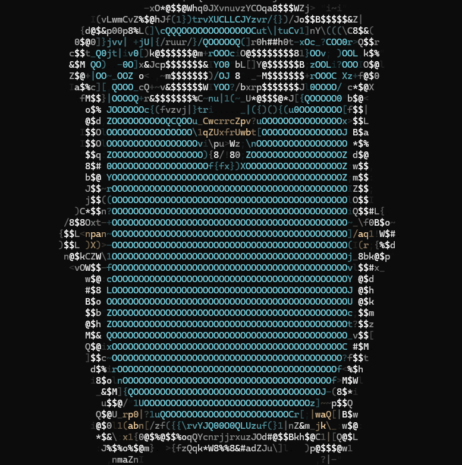

# GoToEasyAscii

Генератор ASCII-арта из изображений с поддержкой цветного вывода, полностью написанный на языке Go!

  

# Возможности
 * Преобразование изображений в ASCII-арт с сохранением пропорций
 * Цветной режим с использованием ANSI-escape последовательностей (256‑цветная палитра)
 * Адаптивная рампа — автоматический выбор инвертированного набора символов для тёмного или светлого фона терминала
 * Параллельная обработка — использует все ядра процессора для ускорения на больших изображениях
 * Настраиваемая ширина выходного арта
 * Кеширование ANSI‑кодов для повышения скорости при цветном выводе
 * Поддержка форматов JPEG и PNG через image.Decode

# Запуск и команды
См. [commands.md](commands.md)